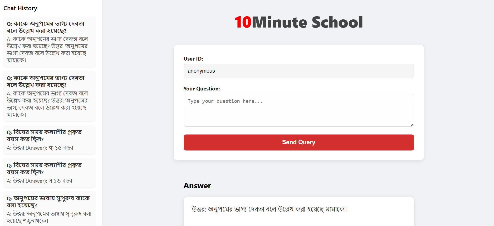

# RAG API Chatbot Project


## Project Overview

This project is a Retrieval-Augmented Generation (RAG) based chatbot backend built with Django REST Framework, integrated with a React frontend for interactive chatting. The backend handles document chunking, vector indexing (using FAISS), and retrieving relevant context to answer user queries efficiently.

Key features:  
- Efficient document retrieval with `BAAI/bge-m3` embeddings  
- FAISS vector index for similarity search  
- Chat history stored in Django models  
- REST API endpoint for question answering  
- React frontend with responsive and aesthetic UI  

---

## Getting Started

Follow these steps to clone the repo and set up the project locally.

### Prerequisites

- Python 3.11+
- Node.js & npm (for React frontend)
- Git

---

### Step 1: Clone the Repository

```bash
git clone https://github.com/mr-ahabib/RAG_API.git
cd RAG_API
### Step 2: Install Dependencies


# Create virtual environment (Windows)
```bash
python -m venv venv
venv\Scripts\activate


# Install Python dependencies
```bash
pip install -r requirements.txt

#Run Migrations
```bash
python manage.py makemigrations
python manage.py migrate


#API key
- Use the API key that I included in the submission. because github rejects the api key. So can not upload it here.
- (optional)Make sure, you need to have a GROQ API key from https://console.groq.com/playground. Sign in to it and create a API key from 'API Keys' tab. Copy the api key and replace the (GROQ API KEY HERE) with your key in chat/rag_utils.py 
#Run server
--bash
python manage.py runserver

The backend API will be available at http://localhost:8000/api/chat/


---
Md. Ahashan Habib
Email:mr.ahashan261@gmail.com
Phone: +8801709-180782
